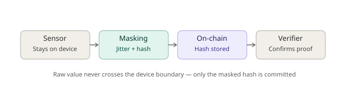

# NoetoZyn (νοητο-ζύν)
### **The Decentralized Polymorphic Privacy Firewall Agent Architecture on Solana**
***
Developed by **Quantum Synergi** for the **Colosseum Crypto World's Fair Hackathon**

Track Alignment: **DePIN** | **Crypto + AI Convergence** | **Infrastructure & Privacy**

NoetoZyn establishes an unprecedented paradigm shift at the intersection of **Confidential AI Systems and Onchain Physical Infrastructure (DePIN)**. It is an autonomous edge agent engineered to return absolute cognitive, neurological, and biological sovereignty to humanity.

---

## Executive Summary (Non-Technical)

### **The Threat: Biological & Cognitive Forgery**
As consumer wearables, smart health patches, and neural interfaces become mainstream, humanity faces an invisible crisis: **the absolute corporate capture of human biology**. These devices continuously stream raw, un-encrypted physiological data (heart rate variability, EEG brainwaves, metabolic inputs) directly into centralized cloud databases. These unique biological signatures are aggregated, modeled, and weaponized by centralized AI systems to profile human attention, predict behavioral shifts, and exploit emotional vulnerabilities.

### **The Solution: A Body-Boundary Shield**
**NoetoZyn flips the battlefield.** Instead of forcing humans to detach from advanced technology, NoetoZyn operates as an active, intelligent **Biometric Firewall** right at the network edge. It allows everyday citizens to confidently **explore** advanced health tech, financially **thrive** by owning their anonymized data footprints, and truly **sleep safe at night** knowing their physical bodies and minds remain structurally dark to predatory algorithms. 

*“Sovereignty does not stop at the digital UI. It begins at the biological layer.”* — **Quantum Synergi**

---

## The Core Problems Solved

* **Predatory Data Harvesting:** Monopolistic LLM scrapers ingest high-value biometric metrics without user consent or explicit economic compensation.
* **Biological Identity Cloning:** Centralized storage of raw telemetry maps immutable, unique human physiological profiles that can be reverse-engineered or falsified if leaked.
* **Algorithmic Vulnerability Exploitation:** Continuous analysis of human stress markers allows external interfaces to execute psychological target manipulations in real-time.

---

## Technical Architecture & System Flow (Technical)




NoetoZyn replaces soft software text rules with **hard cryptographic boundaries** by uniting edge computation with the Solana ledger.

### **System Data Pipeline**
* **[Raw Biometric Telemetry Stream]** Intercepted via the local edge hardware gateway.
* **[Somatic Edge Interceptor Layer]** Managed via an optimized elizaOS runtime environment executing independent of corporate cloud infrastructure.
* **[Polymorphic Inversion Matrix]** Generates dynamic mathematical perturbations to mask personal identifiers while maintaining analytical macro-trends.
* **[Zero-Knowledge Proof Settlement]** Compresses state validations without leaking biometric signatures.
* **[Solana State Verification Anchor]** Settles proofs publicly for trusted third-party dApp authorization checks.

### **1. Somatic Edge Interceptor Layer**
A lightweight, optimized execution runtime intercepts raw biological telemetry streams (HRV, EEG, biometric vectors) directly at the local device layer before any external packet transmission occurs.

### **2. Polymorphic Inversion Matrix**
Rather than encrypting data statically—which leaves patterns vulnerable to advanced clustering algorithms—the agent maps biometric parameters onto shifting geometric noise vectors. 
* **Mathematical Perturbation:** The engine injects localized noise tensors that successfully degrade the predictive accuracy of tracking models.
* **Data Integrity:** The transformation filters out unique identity markers while preserving general macro-analytical trends (e.g., verifying a user is asleep or highly focused without exposing their unique heart pattern).

### **3. Ephemeral On-Chain Verification Anchors**
The agent hashes the masked state parameters and passes them into zero-knowledge state accounts on Solana via optimized, high-throughput program paths. External applications query the on-chain ledger to verify biometric authentication without ever seeing the raw vitals.

---

## Smart Contract Schema & State Specifications

The on-chain protocol state ledger is built using the **Solana Anchor Framework**, designed for absolute gas optimization and sub-second validation routines.

### **On-Chain State Account Layout**
```rust
#[account]
pub struct ProofCheckpoint {
 pub guardian_wallet: Pubkey, // 32 bytes | The sovereign user's authority key
 pub telemetry_stream_id: [u8; 16], // 16 bytes | Unique ephemerally rotated stream tag
 pub masked_state_hash: [u8; 32], // 32 bytes | The cryptographic hash of the perturbed vitals
 pub timestamp: i64, // 8 bytes | Unix epoch millisecond verification lock
 pub is_active_shield: bool, // 1 byte | Hardware-isolated circuit breaker flag
}
```

### **The Sovereign Bio-Circuit Breaker**
If an unauthorized external application attempts to force-inject semantic payloads or read unauthorized telemetry ranges, the edge agent flags the anomaly and hits the `trigger_circuit_breaker` instruction on-chain. This immediately slashes the malicious contract’s state deposit, deactivates the channel, and severs the link on the protocol layer.

---

## Competitive Landscape & Novelty (Colosseum Copilot Search)

NoetoZyn's core concept — biometric privacy firewall, edge-side telemetry masking,
health/EEG data, zero-knowledge-adjacent proofs — was checked against Colosseum
Copilot's project-search corpus (`/search/projects`), which spans 5,400+ Solana
hackathon submissions.

As of **September 11, 2026**, a live query returned 6 total results, with the
closest matches shown below (similarity scores, live from the dashboard's
`/api/copilot` endpoint):

| Project | Similarity | What it does |
|---|---|---|
| Spiral Safe | 0.054 | Simplifies Web3 onboarding by replacing seed phrases with passkeys and biometrics |
| DTOX | 0.032 | Decentralized telemetry and monitoring infrastructure built on Solana |
| zk-IoT | 0.032 | Zero-knowledge verification of IoT sensor data on Solana for private compliance payouts |
| AIGun | 0.031 | An AI-driven exchange delivering trading signals and execution without noise |
| AI FHE Healthcare IoT | 0.031 | Privacy-preserving AI combining healthcare IoT devices and Zama FHE with Solana rewards |

**Reading the gap:** the closest adjacent projects use biometrics for *authentication*
(Spiral Safe), general IoT/telemetry *infrastructure* (DTOX), IoT sensor *compliance*
proofs (zk-IoT), or FHE-based *healthcare* data privacy (the last entry) — none of
them intercept raw biometric telemetry at the edge and apply polymorphic masking
in real time before it ever leaves the device, anchoring only the masked-state hash
on-chain. All similarity scores stayed under 0.06.

This reflects one search against Copilot's corpus at a single point in time, not a
permanent or exhaustive claim — the corpus grows as new projects are submitted, so
this table will drift. Rather than treat this snapshot as definitive, NoetoZyn's
live dashboard queries Copilot's `/search/projects` endpoint directly and in real
time: **run it yourself and see the current results**, rather than trusting a
static table in a README.
---

## Ecosystem Alignment with the World's Fair

* **DePIN:** Redefines Decentralized Physical Infrastructure by pushing the perimeter security directly to the human biological layer, turning individual wearables into sovereign node citadels.
* **Crypto + AI Convergence:** Shifts artificial intelligence from a predatory extraction tool into a localized, alignment-driven guardian bounded firmly by deterministic blockchain law.
* **Performance & Scale:** Utilizes Solana's ultra-low base transaction fees to seamlessly manage high-velocity telemetry proof handshakes at scale without economic friction.

***
### **Quantum Synergi** • *Vanguard Technologies for the Sovereign Era.*
